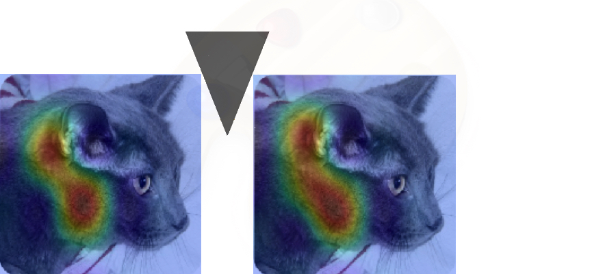

# keras-wedge


Design, implementation and documentation of Wedge Dropout.

## Install

```bash
pip install keras-wedge
```

## Introduction
If a Convolutional Neural Network creates these two feature maps when presented with this image, that means that the feature maps are redundant. Wedge Dropout makes these feature maps less similar. It drives a wedge between them and pushes them apart.



## Documentation

Wedge Dropout implements a recent technique in Convolutional Network Design: critiquing feature maps. Wedge Dropout analyzes random pairs of feature maps created by a CNN and contributes negative feedback to those feature maps that correlated. This has the effect of improving the CNN's performance because the analysis checks a basic quality of good feature maps: decorrelation. After all, if two feature maps describe the same feature:
* they are redundant, which means that the feature map set is not as descriptive as it could be 
* they bias the model by ascribing extra importance to that feature

See this notebook for a detailed explanation of the concept:


See this notebook for a demonstration of our analysis function in a simple CNN:


